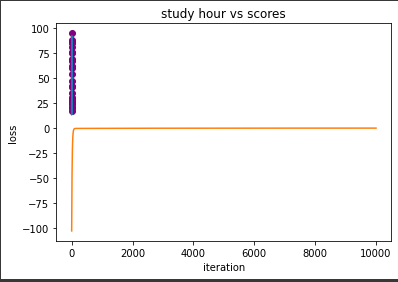

# Implementation-of-Linear-Regression-Using-Gradient-Descent

## AIM:
To write a program to implement the linear regression using gradient descent.

## Equipments Required:
1. Hardware – PCs
2. Anaconda – Python 3.7 Installation / Moodle-Code Runner

## Algorithm
1.For Gradient Design use the standard libraries in the python.

2.Use the .isnull()function to check the empty .

3.Use the default function.

4.Use the loop function for a linear equation.

5.Predict the value for the y.

6.Print the program.

7.Plot the graph by using scatters keyword.

8.End the program. 

## Program:
```
/*
Program to implement the simple linear regression model for predicting the marks scored.
Developed by: Mirudhula D
RegisterNumber: 212221230060 
*/
```
```
import numpy as np
import pandas as pd
import matplotlib.pyplot as plt
dataset = pd.read_csv('student_scores.csv')
dataset.head()
X=dataset.iloc[:,:-1].values
Y=dataset.iloc[:,1].values
from sklearn.model_selection import train_test_split
X_train,X_test,Y_train,Y_test = train_test_split(X,Y,test_size = 1/3,random_state = 0)
from sklearn.linear_model import LinearRegression
regressor = LinearRegression()
regressor.fit(X_train,Y_train)
Y_pred = regressor.predict(X_test)
plt.scatter(X_train,Y_train,color="green")
plt.plot(X_train,regressor.predict(X_train),color="purple")
plt.title("Hours vs Scores (Training Set)")
plt.xlabel("Hours")
plt.ylabel("Scores")
plt.show()
plt.scatter(X_test,Y_test,color="pink")
plt.plot(X_train,regressor.predict(X_train),color="orange") 
plt.xlabel("Hours")
plt.ylabel("Scores")
plt.show()


```
## Output:



## Result:
Thus the program to implement the linear regression using gradient descent is written and verified using python programming.
